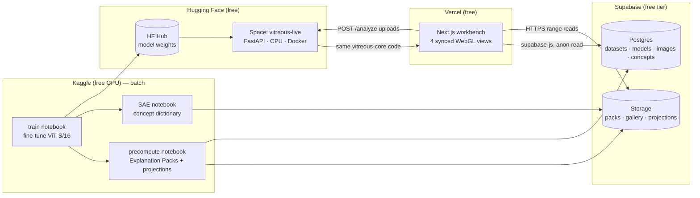

# ViTreous — Explainable Vision Transformer Workbench

**Architecture & Implementation Plan · v1.0 · 2026-07-06**

ViTreous (*vitreous* = glass-like, transparent; *ViT* = the model class it explains)
is a multi-view visual analytics platform for Vision Transformers: a deployed,
zero-cost, portfolio-grade workbench in which an image's classification is
explorable as a time-evolving computation across four synchronized spaces —
Image, Gaussian Feature Field, Interaction Graph, and Latent Embedding.

This document is the design contract. It supersedes the legacy
`hatchvision/` + `webapp/` system, which remains in the repo as historical
reference only.

---

## 1. Requirements (as established in the interview)

| Dimension | Decision |
|---|---|
| Purpose | Portfolio / public demo piece — polish, correctness, zero-setup exploration |
| Budget | **$0/month.** GPU only on Kaggle; storage on Supabase; frontend on Vercel; other services must be free-tier |
| Compute model | Hybrid: heavy artifacts precomputed per image on Kaggle GPU into **Explanation Packs**; live uploads analyzed by a free CPU service running the same code |
| Model (v1) | ViT-S/16 (timm `deit_small_patch16_224`), fine-tuned per dataset; GraphProvider abstraction keeps the system model-agnostic |
| Datasets (v1) | EuroSAT (primary demo) + Oxford-IIIT Pet (swap proof). Adapter layer; switching datasets = configuration only |
| XAI depth | Attention suite + Chefer relevance + Grad-CAM + Integrated Gradients + **faithfulness metrics** (deletion/insertion, method agreement) + **concept tier** (sparse autoencoder features) |
| Flagship view | Gaussian Feature Field (the novel signature visual) |
| Graph | Two modes behind a toggle: per-layer view (~250 nodes) and full unrolled all-layers view (~2.4k nodes) → one WebGL renderer |
| v1 scope | Everything: curated gallery, live uploads, faithfulness, concepts, end-to-end dataset switching |
| Repo | Monorepo; new code in `apps/`, `packages/`, `kaggle/`, `docs/`; legacy `hatchvision/`, `webapp/`, `notebooks/`, `scripts/`, `tests/` untouched |
| Design | Dark scientific instrument: near-black canvas, luminous marks, monospaced readouts |

### Research grounding (summary of the Phase-1 review)

- **Primary token attribution:** Chefer et al. (CVPR/ICCV 2021) gradient×attention
  relevance — consistently more faithful than raw attention rollout on
  perturbation benchmarks. Rollout (Abnar & Zuidema 2020), Grad-CAM, and
  Integrated Gradients (Sundararajan 2017) ship as comparison lenses; the UI
  treats *method disagreement as signal*, following the "attention is not
  explanation" literature (Jain & Wallace 2019).
- **Multi-view design** follows the coordinated-multiple-views tradition of
  AttentionViz (VIS 2023), Summit / NeuroCartography (VIS), and the CNN
  Explainer / Diffusion Explainer line — whose key operational lesson we adopt:
  **precompute per-image explanation packs; render client-side**.
- **Gaussian feature fields** as an interpretability bridge are novel as a
  visualization affordance (relatives: GaussianImage ECCV 2024, LangSplat /
  Feature-3DGS). They are a *lens*, not an attribution method: every Gaussian
  parameter is derived deterministically from model-measured quantities, and
  the UI labels the view accordingly.
- **BDH evaluation** (arXiv:2509.26507 + this repo's adaptation): we **adopt**
  observation-only forward hooks (training is bit-identical with/without
  instrumentation, enforced by test), sparse-positive unit spaces as good
  graph material, and exported explanation bundles. We **reject** neurons as
  the core node abstraction, Hebbian co-activation as default edge semantics
  (correlational, not causal — attention-weighted token edges are the
  validated default), and all neuroscience framing in UI copy.
- **Concept tier:** k-sparse autoencoders over token activations (Anthropic
  interpretability line, applied to ViTs 2024-25) rather than raw-neuron
  clustering; concepts get exemplar-patch grids and optional CLIP text probes.

---

## 2. System topology ($0 deployment)



One Python package (`packages/core`, import name `vitreous`) contains **all**
instrumentation, XAI, Gaussian, graph, and pack-writing logic. Kaggle
notebooks and the HF Space are thin shells around it — one code path,
two venues. That is the central lesson taken from the abandoned prototype,
generalized.

Free-tier constraints designed for, not around:

- **Supabase Storage 1 GB / 5 GB egress:** packs are quantized + top-k
  sparsified (§5), budget ≈ 3–6 MB/image → 100–150 gallery images across two
  datasets, with headroom. Overflow valve: public HF dataset repo (also free)
  behind the same `StorageAdapter` interface.
- **HF Space free CPU (2 vCPU):** ViT-S/16 fully-instrumented analysis in
  ~5–20 s; the UI shows staged progress (predict → attention → attributions →
  concepts) rather than a blank spinner. Free Spaces sleep when idle; the UI
  detects 503-warming and says so honestly.
- **Kaggle:** ~30 GPU-h/week — fine-tuning ViT-S on EuroSAT/Pet is minutes,
  precompute for 150 images is minutes, SAE training is < 1 h.

---

## 3. Monorepo layout

```
apps/
  web/            Next.js 14+ · TypeScript · Tailwind · the workbench
  live/           FastAPI service (Dockerfile targets HF Spaces free CPU)
packages/
  core/           Python: `vitreous` — datasets, models, instrument, xai,
                  gaussians, graph, concepts, packs, storage
  schema/         Single source of truth: JSON Schema for the Explanation
                  Pack + generated Pydantic (Python) and TypeScript types
kaggle/
  train.ipynb         fine-tune per dataset (dataset name is the only knob)
  precompute.ipynb    gallery → packs → Supabase
  sae.ipynb           token-activation SAE → concept dictionary
docs/
  ARCHITECTURE.md     this file
hatchvision/ webapp/ notebooks/ scripts/ tests/    ← legacy, untouched
```

---

## 4. Dataset abstraction layer

Rebuilt from first principles but keeping the legacy registry idea that
worked. A dataset is a **declarative spec + an adapter class**; everything
downstream (transforms, training, packs, UI labels, colors) derives from it.

```python
@register_dataset("eurosat")
class EuroSATAdapter(DatasetAdapter):
    spec = DatasetSpec(
        name="eurosat", display_name="EuroSAT — land use from Sentinel-2",
        num_classes=10, image_size=224, channels=3,
        class_names=[...], class_colors=[...],          # UI derives palettes
        license="MIT", citation="Helber et al. 2019",
        kaggle_sources=["apollo2506/eurosat-dataset"],  # notebook auto-attach
    )
    def load(self, root, split) -> Iterable[Sample]: ...
    def preprocess(self) -> Transform: ...              # eval transform
    def augment(self) -> Transform: ...                 # train transform
    def splits(self) -> SplitPolicy: ...                # incl. grouped splits
    def gallery(self, n=75) -> list[Sample]: ...        # curated demo images
    def viz_hooks(self) -> VizHooks: ...                # per-dataset UI extras
```

- **Kaggle-notebook reuse:** adapters accept the raw directory layouts that
  existing Kaggle datasets ship (folder-per-class, CSV+images), matching the
  legacy loaders' auto-detection approach. Existing preprocessing pipelines
  plug in as the `preprocess/augment` callables — nothing else changes.
- **Switching datasets = one string.** `kaggle/train.ipynb` and
  `precompute.ipynb` take `DATASET = "eurosat"` at the top; the web app reads
  the dataset list from Postgres and renders a switcher. Proven in v1 by
  shipping EuroSAT *and* Oxford-IIIT Pet through the identical path.
- v2 adapters (ISIC via the legacy CSV logic, CIFAR-100, Intel, Caltech-101)
  are additive files, no core changes.

---

## 5. The Explanation Pack (central data contract)

Everything the frontend renders comes from a **pack**: one directory of
assets per analyzed image, identical whether produced by Kaggle batch or the
live CPU service. Format frozen at Milestone M1; `packages/schema` generates
Pydantic + TS types from one JSON Schema so drift is impossible.

```
pack/
  manifest.json         version, model, dataset, image meta, prediction,
                        class probabilities, asset index, timings
  attention.bin         [L=12][H=6][197][197] uint8 (per-row max-quantized)
  tokens.bin            [L+1][197][384] fp16 token embeddings (layer inputs + final)
  attributions.json     index of per-method assets
  attr_chefer.bin       [197] fp32 + per-layer intermediates [L][197]
  attr_rollout.bin      [L][197] fp32 (cumulative rollout per layer)
  attr_gradcam.bin      [14][14] fp32
  attr_ig.bin           [197] fp32 (+ 224×224 pixel-level PNG heatmap)
  gaussians.bin         [L+1][197] × {x,y,rx,ry,theta,r,g,b,a,activation,
                        attention_in, attribution} fp16 — §7
  graph.json            nodes/edges per layer + unrolled index — §8
  concepts.json         top-k SAE features per token per probe layer,
                        feature ids → dictionary refs — §9
  faithfulness.json     deletion/insertion curves + AUC per method,
                        Spearman method-agreement matrix — §10
  image.webp            original (max 512px)
```

Size discipline: uint8 attention (per-row scale) ≈ 2.8 MB → ~1.5 MB after
zstd; fp16 tokens ≈ 2 MB → ~1.5 MB; everything else < 1 MB. **≈ 3–6 MB/pack.**
`manifest.json` loads first; binaries stream on demand per view (HTTP range
requests against Supabase public storage), so first paint needs ~100 KB.

The **shared inference timeline** is implicit in the pack: every per-layer
asset is indexed `t = 0..L`, and the frontend's replay clock is just an
interpolation over `t` (§12).

---

## 6. Instrumentation & XAI pipeline (`vitreous.instrument`, `vitreous.xai`)

- **Observation-only hooks** (adopted from BDH/legacy, kept as a hard
  guarantee): `Instrumenter(model).capture(image)` registers forward hooks on
  attention softmaxes and block outputs, runs inference, detaches, and returns
  a `Trace`. A regression test asserts logits are bit-identical with hooks
  on/off.
- **Methods** (each a pure function `Trace|model, image -> Attribution`):
  - `attention_maps` — raw per-layer/head (from Trace)
  - `attention_rollout` — cumulative, per-layer prefix products
  - `chefer_relevance` — gradient×attention relevance propagation
    (class-specific; the default lens)
  - `grad_cam` — on the last block's token grid
  - `integrated_gradients` — 20 steps, pixel- and token-level
- **Faithfulness** (`vitreous.xai.eval`): deletion & insertion curves
  (patch-masking in ranked order, 20 steps), AUC per method, pairwise
  Spearman rank correlation between methods. Precomputed for gallery packs;
  computed on demand (with a progress stage) for uploads.
- All methods write into the pack via one `PackWriter`, which enforces the
  schema and the quantization rules.

---

## 7. Gaussian Feature Field (`vitreous.gaussians` + flagship view)

**Honesty rule:** every Gaussian parameter is a deterministic function of
measured quantities — geometry from patch positions, appearance from image
statistics, dynamics from model internals. No fitted structure the model
doesn't use; the view is labeled as a lens.

Per token *i*, per timeline step *t*:

| Parameter | Source |
|---|---|
| center (x, y) | patch center (fixed) |
| covariance (rx, ry, θ) | patch size, anisotropically stretched toward the token's dominant attention neighbors at layer *t* (bounded eccentricity) |
| base RGB | mean color of the patch's pixels |
| opacity | normalized activation magnitude ‖token‖ at layer *t* |
| emissive glow | attribution score (Chefer by default; method switchable) |
| halo radius | attention received (column-sum of layer-*t* attention) |

Rendering (`apps/web`): three.js instanced quads with an analytic Gaussian
falloff + additive-glow shader — 197 instances × interpolated over *t* is
trivially 60 fps; the same renderer scales to ViT-S/8's 785 tokens later.
During replay the field visibly shows **diffusion of importance**: opacity
and glow flow across the image as layers deepen. Hover/selection hit-testing
via an offscreen ID buffer.

---

## 8. Interaction Graph (`vitreous.graph` + GraphProvider)

**GraphProvider abstraction (backend):**

```python
class GraphProvider(Protocol):
    def nodes(self, trace) -> list[GraphNode]     # id, kind, layer, ref
    def edges(self, trace, layer) -> list[GraphEdge]
    def communities(self, ...) -> list[Community]
```

`GraphNode.kind ∈ {patch_token, cls_token, attention_head, concept, community, unit, …}`
and `ref` points into pack assets (token idx, Gaussian idx, concept id). v1
ships `ViTTokenGraphProvider` (default) and `ConceptGraphProvider`; the
interface is what admits CNNs, sparse-unit models (BDH-style), or diffusion
models later without touching the frontend.

**Default semantics (validated, not speculative):** nodes = tokens (+ CLS,
+ per-layer head nodes as optional rings); edges = **top-k (k=8) attention
weights** at layer *t*, weight-encoded as width/luminance. Concept nodes
attach to their top-activating tokens. Community detection (Louvain over the
layer's attention graph) is precomputed per layer into `graph.json`.

**Frontend:** Sigma.js (WebGL) + graphology. Two modes, one renderer:
- *Layer mode* (~250 nodes): tokens anchored to their spatial grid (so the
  graph stays legible as an image), heads in an outer ring; scrubbing the
  timeline swaps edge sets with animated transitions.
- *Unrolled mode* (~2.4k token-nodes = 197 × 12 + concepts): layers as
  vertical strata, residual-stream edges between consecutive layers,
  community collapse/expand, semantic zoom. Degrades gracefully by
  edge-thresholding first.

Interactions: zoom/pan, hover, select, filter by layer/kind/importance
threshold, search by class-name/concept/patch coordinates, collapse
communities, replay animation.

---

## 9. Concept tier (`vitreous.concepts`)

- **k-sparse autoencoder** (4096 features, k=32) trained on Kaggle over
  layer-9 token activations from the fine-tuned model's training set
  (~1–2 M token vectors; < 1 h GPU).
- Dictionary artifact per (model, dataset): feature → top-64 exemplar patches
  (image id + token idx + activation), class-conditional firing rates, and an
  optional CLIP-text probe label (auto-suggested, human-editable) — labels are
  marked *suggested*, exemplars are ground truth.
- Packs store each token's top-k active features; the graph gains concept
  nodes; the embedding explorer can color by concept; hovering a concept
  lights up every view (§11).
- Explicit fallback: if SAE features on a small dataset are low-quality
  (dead/duplicated features), the `ConceptProvider` interface also admits the
  simpler PCA/k-means clustering of token activations — same pack format,
  decided per-dataset by a quality gate (feature death rate, exemplar
  coherence spot-check).

## 10. Latent Embedding Explorer

- Dataset-level projections precomputed on Kaggle per layer ∈ {0, 3, 6, 9, 12}:
  UMAP (default), PCA, t-SNE, over CLS tokens (per-image points, ~27k for
  EuroSAT) and optionally patch tokens for a chosen gallery subset.
- Stored as one fp16 coordinate buffer per (dataset, layer, method) in
  Supabase; rendered with `regl-scatterplot` (WebGL, 100k+ points at 60 fps).
- Per-image inference trajectories: the current image's CLS position at each
  layer, projected into each layer's map via the fitted reducer (UMAP
  `.transform`), drawn as a comet-trail across the replay.
- Uploads: the live service returns the upload's projected coordinates using
  the persisted reducers — uploads appear *inside* the dataset landscape.

## 11. Bidirectional synchronization (frontend core)

One Zustand store holds a single **selection model**; no view talks to
another view directly:

```ts
interface Selection {
  imageId: string
  t: number                      // timeline position, 0..L, fractional
  hover?:  EntityRef             // transient
  pinned?: EntityRef[]           // sticky selections
  method:  "chefer" | "rollout" | "gradcam" | "ig"
}
type EntityRef =
  | { kind: "token";   layer: number; idx: number }
  | { kind: "gaussian";layer: number; idx: number }   // ≅ token, distinct for hit-testing
  | { kind: "node";    id: string }
  | { kind: "concept"; id: string }
  | { kind: "point";   imageId: string; layer: number }
  | { kind: "patch";   row: number; col: number }
```

A pure **resolver** maps any `EntityRef` to the full linked set
(token ↔ gaussian ↔ graph node ↔ embedding point ↔ image patch ↔ concepts)
using the pack's index maps — O(1) lookups, so hover propagation across all
four views stays under one frame. Every view = subscriber (renders highlight)
+ emitter (publishes hover/select). This is the entire synchronization
architecture; its simplicity is the point, and it is what the legacy system
lacked.

## 12. Temporal inference replay

- The pack's per-layer indexing *is* the timeline; the frontend replay clock
  interpolates `t` continuously and each view defines how to render
  fractional `t` (Gaussians interpolate parameters; graph cross-fades edge
  sets; embedding trail advances; image-space overlays blend).
- Transport bar: play/pause, scrub, speed, per-layer step; keyboard-driven.
- **Run comparison:** two packs side-by-side with a shared clock (same image
  under two models/datasets/checkpoints, or two images under one model);
  diff overlays for attention and attribution. Ships as the last milestone.

## 13. Image Space view

Original image (WebP), patch grid overlay, prediction + top-5 class
probability bars, dataset metadata chip, per-method saliency overlay
(switchable, with method-agreement badge from `faithfulness.json`), hover =
patch-level `EntityRef` emission. Deliberately the most conventional view —
it anchors trust before the exotic views open.

## 14. Live service & API (`apps/live`, FastAPI on HF Spaces CPU)

```
GET  /health                → { status, model, dataset, warm }
GET  /models                → available (model, dataset) pairs
POST /analyze               multipart image + dataset id → { job_id }
GET  /jobs/{id}/events      SSE: staged progress
                              (predict → attention → chefer → gradcam → ig
                               → gaussians → graph → concepts → faithfulness)
GET  /jobs/{id}/pack/{asset} pack assets (same layout as Supabase packs)
```

Single worker, small in-memory job queue (portfolio traffic), rate-limited,
10 MB upload cap, EXIF-stripped, uploads ephemeral (never persisted).
Gallery reads never touch this service — they go straight to Supabase CDN.
The Space Dockerfile installs `packages/core`; the notebook and the Space
literally import the same `vitreous.packs.build_pack()`.

## 15. Storage & metadata (Supabase)

Postgres (read via anon key from the web app; written by Kaggle notebooks
via service key):

```sql
datasets(id, name, display_name, spec jsonb)
models(id, dataset_id, arch, hf_repo, metrics jsonb, created_at)
gallery_images(id, dataset_id, model_id, class_label, pred_label,
               confidence, pack_prefix, thumb_url, tags text[])
projections(id, dataset_id, model_id, layer, method, url, reducer_url)
concept_dictionaries(id, model_id, layer, url, quality jsonb)
```

Storage buckets: `packs/{dataset}/{image_id}/…`, `projections/…`,
`concepts/…`, `thumbs/…` — all public-read; the frontend needs no server of
its own for the gallery experience (Next.js stays static/ISR on Vercel).

## 16. Implementation roadmap (Opus work packages)

Fable 5 orchestrates; **Opus agents implement** each milestone against this
document. Every milestone lands as reviewed commits on
`claude/explainable-vit-research-qadg2i` with tests.

| M | Deliverable | Key acceptance test |
|---|---|---|
| M0 | Monorepo scaffold: `apps/web` (Next+TS+Tailwind, dark theme shell), `apps/live` stub, `packages/core` skeleton, `packages/schema` with pack JSON Schema → Pydantic + TS codegen, CI (pytest + tsc + lint) | CI green; schema round-trips a fixture pack in both languages |
| M1 | `vitreous.data` (DatasetSpec, registry, EuroSAT + Oxford Pet + imagefolder adapters) + `vitreous.models` (timm ViT-S/16 wrapper) + `Instrumenter` | hook-purity test (logits bit-identical); both adapters yield correct shapes/splits from Kaggle-layout dirs |
| M2 | XAI suite: rollout, Chefer, Grad-CAM, IG + faithfulness (deletion/insertion, agreement) + `PackWriter` | fixture image → complete valid pack; Chefer map sanity-checks against known DeiT example; faithfulness AUC(chefer) > AUC(random) |
| M3 | `vitreous.gaussians` + `vitreous.graph` (ViTTokenGraphProvider, Louvain communities) + projections module (UMAP/PCA/t-SNE + persisted reducers) | pack gains gaussians/graph/projection assets; all schema-valid; graph node/edge counts match spec |
| M4 | Kaggle notebooks (train / precompute / SAE) + Supabase schema migration + `StorageAdapter` (Supabase primary, HF-dataset overflow) + `vitreous.concepts` (SAE + k-means fallback + quality gate) | dry-run: shapes dataset end-to-end locally → packs upload to Supabase; notebook runs top-to-bottom on Kaggle |
| M5 | Web app data layer (pack loader w/ range requests, Supabase client, Zustand selection store + resolver) + Image Space view + gallery + dataset switcher | gallery browsable from real Supabase packs; hover emits EntityRefs (visible in debug panel) |
| M6 | **Gaussian Feature Field view** (three.js instanced shader, replay interpolation, hover ID-buffer, glow polish) + transport bar | 60 fps replay on integrated GPU; hover round-trip < 16 ms |
| M7 | Interaction Graph view (Sigma.js, both modes, communities, filters, search) + Latent Embedding Explorer (regl-scatterplot, trajectories) + full four-view sync | any-view hover highlights all views < 1 frame; unrolled mode ≥ 30 fps @ 2.4k nodes |
| M8 | Live service on HF Spaces + upload flow with staged SSE progress + upload-into-landscape projection | upload → full pack in < 30 s CPU; UI honest about warming |
| M9 | Concepts UI (dictionary browser, concept nodes, exemplar grids) + faithfulness panel + method-comparison + demo tour + run comparison + final polish, deploy, README | Lighthouse ≥ 90; guided tour covers all four views; EuroSAT ↔ Pet switch is one dropdown |

Sequencing: M0→M1→M2 strictly serial (schema freeze at M2). M3/M4 can
overlap; M5–M7 serial on the frontend; M8/M9 parallelizable.

## 17. Risk analysis

| Risk | Severity | Mitigation |
|---|---|---|
| Scope (four novel views, "everything at once" v1) | High | Milestone gating; pack format frozen at M2 so backend/frontend proceed independently; each view demoable alone |
| Supabase 1 GB cap | Med | 3–6 MB packs, 150-image galleries, `StorageAdapter` overflow to HF datasets |
| SAE concept quality on 27k-image datasets | Med | Quality gate + k-means fallback wired from day one (§9) |
| HF Space sleep/cold starts | Med | Honest warming UI; gallery path never depends on the Space |
| CPU latency for uploads (5–30 s) | Low | Staged SSE progress; prediction arrives in < 1 s, deep assets stream in |
| WebGL perf, unrolled graph | Med | Edge top-k thresholds, LOD, community collapse; acceptance test at M7 |
| Gaussian view perceived as decoration | Med | Honesty rule (§7), visual-encoding legend, method badge, faithfulness panel adjacent |
| Kaggle GPU quota | Low | All jobs are minutes-to-1h; artifacts cached in HF/Supabase |
| Free-tier terms drift | Low | Everything behind adapters (storage, compute venue); no vendor logic in core |

## 18. References

Abnar & Zuidema, *Quantifying Attention Flow in Transformers*, ACL 2020 ·
Chefer et al., *Transformer Interpretability Beyond Attention Visualization*,
CVPR 2021 & *Generic Attention-model Explainability*, ICCV 2021 ·
Sundararajan et al., *Axiomatic Attribution (IG)*, ICML 2017 · Selvaraju et
al., *Grad-CAM*, ICCV 2017 · Jain & Wallace, *Attention is not Explanation*,
NAACL 2019 · Adebayo et al., *Sanity Checks for Saliency Maps*, NeurIPS 2018 ·
Yeh et al., *AttentionViz*, IEEE VIS 2023 · Hohman et al., *Summit*, IEEE VIS
2019 · Park et al., *NeuroCartography*, IEEE VIS 2021 · Wang et al., *CNN
Explainer*, IEEE VIS 2020 · Kerbl et al., *3D Gaussian Splatting*, SIGGRAPH
2023 · Zhang et al., *GaussianImage*, ECCV 2024 · Qin et al., *LangSplat*,
CVPR 2024 · Bricken et al. / Templeton et al., *Towards Monosemanticity /
Scaling Monosemanticity*, Anthropic 2023-24 · Kosowski et al., *The Dragon
Hatchling*, arXiv:2509.26507 · Helber et al., *EuroSAT*, 2019 · Parkhi et
al., *Oxford-IIIT Pet*, CVPR 2012. Full annotated list with links and the
critical BDH evaluation: [`RESEARCH.md`](./RESEARCH.md); interview record and
orchestration agreement: [`DECISION-LOG.md`](./DECISION-LOG.md). Key
citations re-validated against live sources on 2026-07-06.

## 19. Future extensions

DINOv2/CLIP providers with text probes · CNN provider (forces GraphProvider
honesty) · BDH-style sparse-unit provider (revives the legacy idea behind the
correct abstraction) · ViT-S/8 dense fields · fitted (optimized) Gaussian
refinement mode · counterfactual patch editing (mask/replace a patch, watch
all views react) · dataset-level error-analysis dashboards · WebGPU renderer ·
multi-user annotation of concepts.
